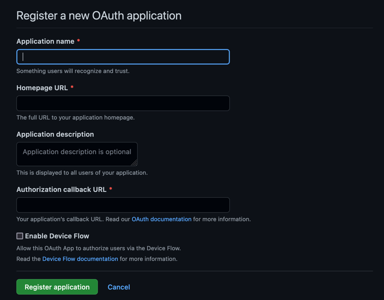

# Authentification avec GitHub OAuth API


Dépôt pour découvrir l'authentification avec GitHub OAuth API.

Autres services d'authentification à proposer sur une application:
* Facebook OAuth API
* Google OAuth API
* Twitter OAuth API
* FranceConnect...

GitHub permet ainsi à ses utilisateurs de se connecter à un site tiers en utilisant ses identifiants.

***

## Dépendances

Le serveur doit d'abord disposer des extensions php **sqlite et **curl****

```bash
# Extension PHP requises
apt install php-sqlite3 php-curl curl

# Redémarrage de Apache
service apache2 restart
```

Dans le projet, installez les librairies nécessaires

```bash
composer install
```

***

## Base de données

Il est nécessaire de garder les informations de l'utilisateur qui réussit à se connecter via GitHub.
Pour cela, on crée une table **users** dans la base.

*sql/users.sql*
```sql
CREATE TABLE `users` (
`id` int(11) NOT NULL ,
`oauth_provider` TEXT CHECK( oauth_provider IN ('github', 'facebook', 'google', 'twitter')) NOT NULL DEFAULT 'github',
`oauth_uid` varchar(50) NOT NULL,
`name` varchar(50) NOT NULL,
`username` varchar(50) NOT NULL,
`email` varchar(100)  NOT NULL,
`location` varchar(50)  DEFAULT NULL,
`picture` varchar(255)  DEFAULT NULL,
`link` varchar(255)  DEFAULT NULL,
`created` TEXT NOT NULL DEFAULT (DATETIME('now')),
`modified` TEXT NOT NULL DEFAULT (DATETIME('now')),
PRIMARY KEY (`id`)
);
```

***

## Classe Client OAuth de connexion

*client/Github_OAuth_Client.php*

C'est une classe PHP qui va gérer les appels REST API à gitHub.

Méthodes:

* getAuthorizeURL() – Generate URL to authorize with the Github account.
* getAccessToken() – Exchange oauth code and get access token from Github OAuth API.
* apiRequest() – Make an API call and retrieve the access token from Github OAuth API.
* getAuthenticatedUser() – Execute the cURL request to get the authenticated user account data from Github User API.


***

## Classe de gestion des utilisateurs

Méthodes:

* Vérifie si l'utilisateur est déjà connu et inscrit en base
* Affiche la liste des utilisateurs en base

***

## Fichier de configuration

Database constants:

    # Lien vers le fichier sqlite de la base de données
    DATABASE_URL="sqlite:sql/database.sqlite"
    DB_USER_TBL="users"

    # GitHub Constants
    CLIENT_ID – Specify the GitHub App Client ID.
    CLIENT_SECRET – Specify the GitHub App Client Secret.
    REDIRECT_URL – Specify the Authorization callback URL.

***

## Création d'une application GitHub

Connectez vous sur votre compte GitHub, allez à:

    Settings > Developper settings > OAuth Apps

Puis, créez une nouvelle OAuthApp




    Application name
    > Nom de l'application. Un nom qui va inspirer confiance aux utilisateurs

    Homepage URL
    > L'URL de l'application

    Application description
    > Description de votre application. Elle est présentées à tous les utilisateurs!

    Authorization callback URL
    > La page de callback après vérification de l'utilisateur

Vous devrez générer un **Client ID** ainsi qu'un **Client Secret**.
Ces informations seront à placer dans le fichier **.env** du projet.